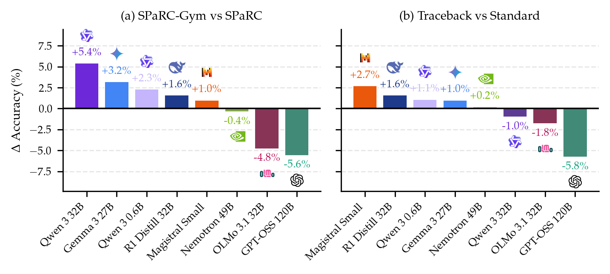
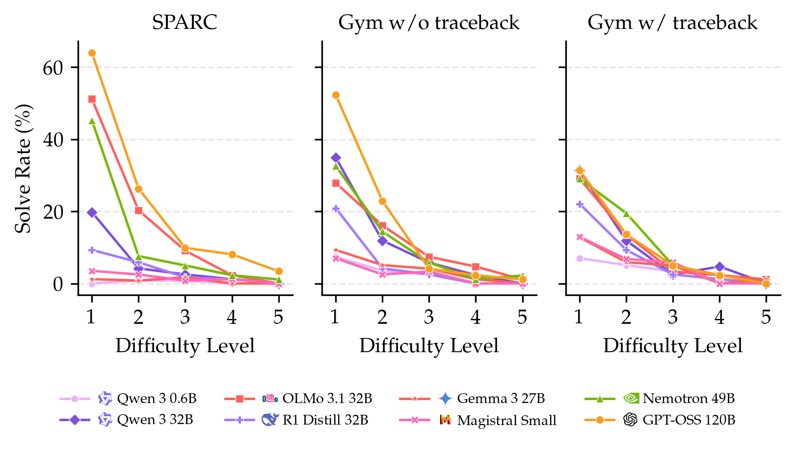
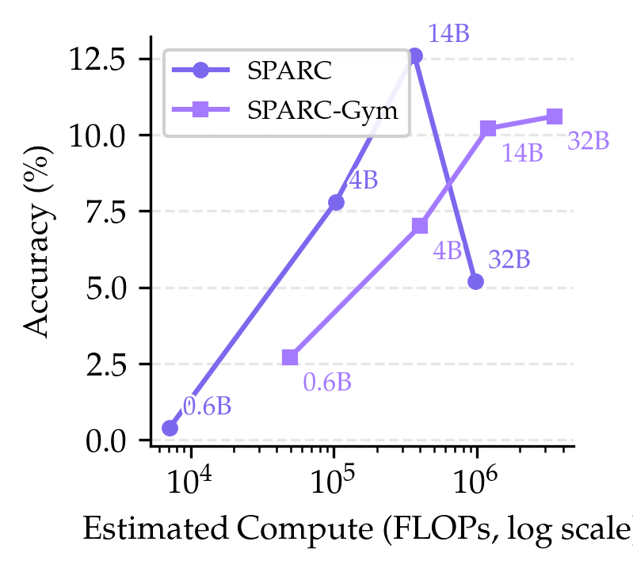
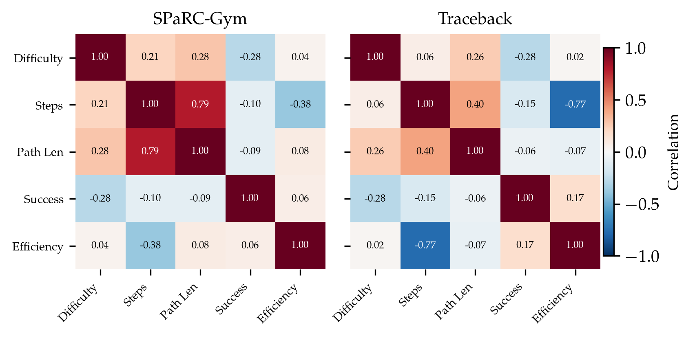

# Spatial Gym Analysis

Analysis and visualization toolkit for **[Spatial Gym](https://github.com/lkaesberg/spatial-gym)**, a benchmark for evaluating large language models on spatial reasoning and constraint-satisfaction puzzles. This repository produces publication-ready plots, LaTeX tables, and statistical analyses comparing LLM performance across multiple benchmark variants.

## Overview

Spatial Gym evaluates how well LLMs can solve spatial reasoning puzzles by navigating grid-based environments with constraints (polyomino regions, path rules, etc.). This toolkit analyzes results across three benchmark variants:

| Variant | Description |
|---------|-------------|
| **SPaRC** | Baseline single-shot evaluation — the model receives the puzzle and produces a solution |
| **Spatial Gym** | Interactive evaluation — the model can iteratively refine its solution via environment feedback |
| **Spatial Gym Traceback** | Interactive evaluation with traceback — the model receives detailed error traces to guide corrections |

### Models Benchmarked

Qwen 3 (0.6B–32B), GPT-OSS 120B, Gemma 3 27B, DeepSeek R1 Distill 32B, Nemotron 49B, OLMo 3.1 32B, Magistral Small, Llama 3.x (8B–70B), Qwen 2.5 (7B–72B), and fine-tuned variants — plus rule-based and random agent baselines.

## Sample Outputs

<p align="center">
  
  
</p>
<p align="center">
  
  
</p>

## Repository Structure

```
spatial-gym-analysis/
├── plot_config.py                 # Shared plot styling, model colors, and statistical helpers
├── regenerate_all_plots.py        # Batch-run all plot scripts
├── plot_*.py                      # Individual plot scripts (20+)
├── generate_latex_table.py        # LaTeX results table generation
├── generate_latex_rule_table.py   # LaTeX rule-based comparison table
├── calculate_tokens.py            # Token usage analysis via tiktoken
├── debug_anomaly.py               # Anomaly detection in traceback data
├── DATASET_STRUCTURE.md           # JSONL schema documentation
├── logos/                         # Model provider logos (PNG/SVG/PDF)
└── results/
    └── spatial_gym/
        ├── *_stats.csv            # Per-model aggregate statistics
        ├── *_details.csv          # Per-puzzle detailed results
        ├── *_gym.jsonl            # Raw Spatial Gym results
        ├── *_gym_traceback.jsonl  # Raw Traceback variant results
        ├── combine.py             # Merge stats CSVs into combined file
        └── spatial_gym_run.sbatch # SLURM job script for vLLM inference
```

## Installation

```bash
git clone https://github.com/lkaesberg/spatial-gym-analysis.git
cd spatial-gym-analysis
pip install matplotlib pandas numpy scipy seaborn tiktoken Pillow
```

> **Note:** Plots use LaTeX rendering by default (`text.usetex = True`). A working LaTeX installation (e.g., TeX Live or MiKTeX) is required for full rendering fidelity. To disable LaTeX rendering, call `setup_plot_style(use_latex=False)` in your scripts.

## Usage

### Regenerate All Plots

```bash
python regenerate_all_plots.py
```

This runs all `plot_*.py` scripts and reports success/failure for each. Generated plots are saved as both PNG (300 dpi) and PDF in the repository root.

### Run Individual Analyses

```bash
# Accuracy comparison across models
python plot_accuracy.py

# SPaRC vs Spatial Gym comparison
python plot_spatial_gym_comparison.py

# Combined three-variant comparison
python plot_combined_comparison.py

# Accuracy by difficulty level
python plot_difficulty_comparison.py

# Model scaling analysis (Qwen family)
python plot_qwen_scaling.py

# Token usage analysis
python plot_token_analysis.py

# Navigation outcome breakdown
python plot_navigation_outcome.py
```

### Generate LaTeX Tables

```bash
python generate_latex_table.py        # Main results table
python generate_latex_rule_table.py   # Rule-based comparison table
```

Output `.tex` files are written to `results/`.

### Combine Statistics

```bash
cd results/spatial_gym
python combine.py
```

Merges individual `*_stats.csv` files into a unified `combined_stats.csv`.

### Token Counting

```bash
python calculate_tokens.py
```

Counts tokens across JSONL result files using [tiktoken](https://github.com/openai/tiktoken).

## Available Plots

| Script | Description |
|--------|-------------|
| `plot_accuracy.py` | Overall accuracy bar chart across models |
| `plot_spatial_gym_comparison.py` | SPaRC vs Spatial Gym accuracy |
| `plot_combined_comparison.py` | Three-variant (SPaRC / Gym / Traceback) comparison |
| `plot_difficulty_comparison.py` | Accuracy broken down by difficulty level |
| `plot_difficulty_vs_steps.py` | Relationship between difficulty and steps taken |
| `plot_traceback_diff.py` | Traceback vs non-traceback performance delta |
| `plot_traceback_steps_vs_path.py` | Traceback steps relative to solution path length |
| `plot_model_ranking_bump.py` | Model ranking shifts across benchmark variants |
| `plot_model_agreement.py` | Inter-model agreement and unique solves |
| `plot_qwen_scaling.py` | Scaling behavior across Qwen model sizes |
| `plot_reasoning_comparison.py` | Reasoning vs non-reasoning model comparison |
| `plot_vision_comparison.py` | Vision-enabled vs text-only comparison |
| `plot_token_analysis.py` | Token usage distribution and efficiency |
| `plot_token_by_difficulty.py` | Token consumption by difficulty level |
| `plot_token_by_difficulty_per_model.py` | Per-model token usage by difficulty |
| `plot_baseline_comparison.py` | Rule-based and random agent baselines |
| `plot_navigation_outcome.py` | Navigation outcome categorization |
| `plot_solve_rate_by_rule.py` | Solve rates broken down by puzzle rule type |
| `plot_correlation_heatmap.py` | Correlation heatmap of evaluation metrics |
| `plot_improvement_ceiling.py` | Upper-bound improvement analysis |

## Data Format

Result files use JSONL format with entries containing puzzle metadata, model outputs, validation metrics, and optional failure annotations. See [`DATASET_STRUCTURE.md`](DATASET_STRUCTURE.md) for the full schema.

Key fields per entry:

```jsonc
{
  "id": "aa31d05ed8fdb273",
  "difficulty_level": 3,            // 1 (easiest) to 5 (hardest)
  "grid_size": {"height": 6, "width": 3},
  "result": {
    "solved": false,
    "analysis": {
      "fully_valid_path": false,
      "no_rule_crossing": false,
      // ... additional validation checks
    },
    "processing_time": 4.74,
    "extracted_path": [{"x": 6, "y": 0}, {"x": 6, "y": 1}]
  },
  "failure_annotation": { /* manual annotation */ },
  "llm_annotation": { /* LLM judge annotation */ }
}
```

## Configuration

All plot styling is centralized in [`plot_config.py`](plot_config.py):

- **Typography** — Palatino serif font, LaTeX rendering, publication-sized labels
- **Model colors** — Distinct colors derived from each provider's brand identity
- **Variant colors** — Consistent green/blue/orange scheme for SPaRC/Gym/Traceback
- **Statistical helpers** — Chi-square test for homogeneity with Cramer's V effect size
- **Logo rendering** — Model provider logos as plot annotations

